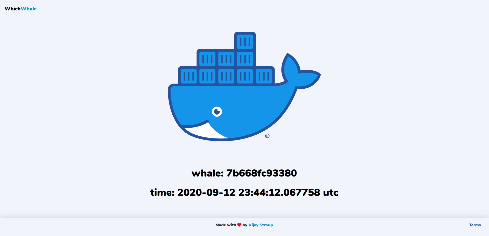

# WhichWhale
Python web server to check which node is handling the current request.

<p align="center">
    
</p>


## Installation
### Non-Swarm
```bash
docker run \
    -d
    -p 80:5000
    vijaystroup/whichwhale
```
### Swarm
```bash
git clone https://github.com/VijayStroup/whichwhale.git && \
    cd whichwhale && \
    docker stack deploy -c docker-compose.yml whichwhale
```

### Links
[GitHub Repo](https://github.com/VijayStroup/whichwhale)

[DockerHub Repo](https://hub.docker.com/r/vijaystroup/whichwhale)
